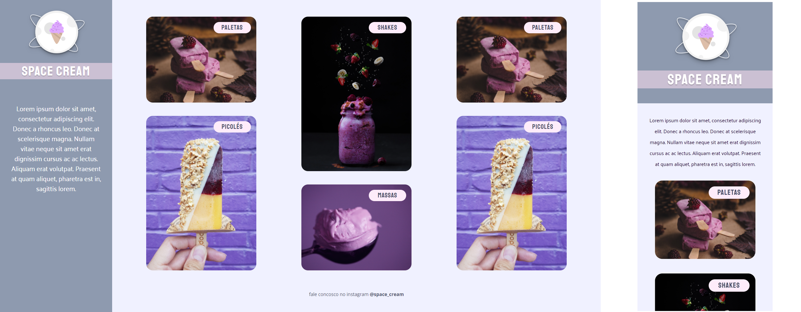

# Explorer - Stage 03

> Space Cream

This was a challenge project to create a responsive mobile-friendly page in HTML & CSS with the following features:

- Grid Layout
- Responsive page for mobile and desktop
- CSS animations
- CSS variables
- Footer that appears on the desktop version, but it's hidden in the mobile version

[Click here to view it live!](https://jessicaranft.github.io/explorer-stage03-SpaceCream/)

## Languages

`HTML` `CSS`

## Software

VSCode
